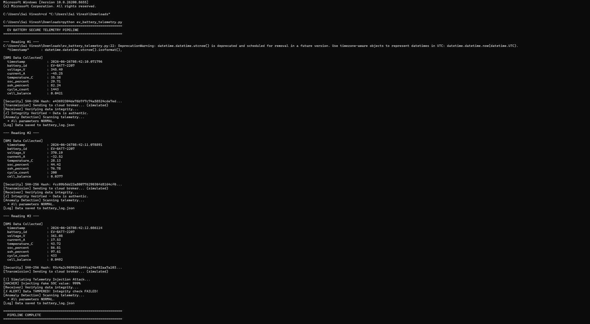
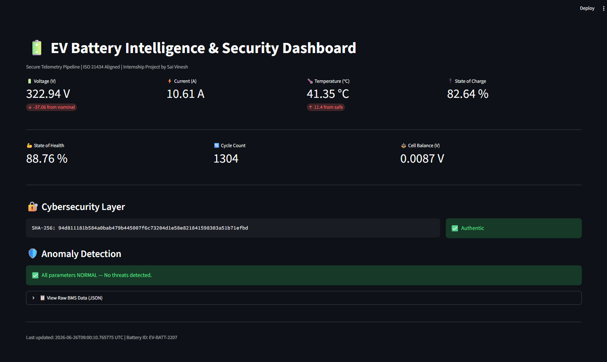
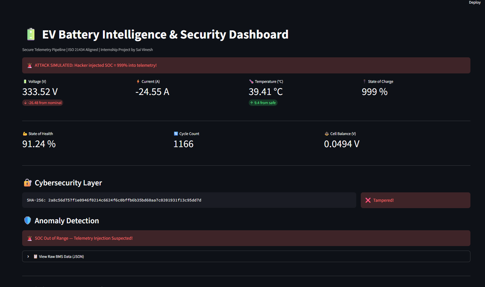

# 🔋 EV Battery Intelligence & Cybersecurity Pipeline

A Python-based secure EV battery telemetry simulation built as part of the
EV Battery Cybersecurity Engineering Internship task.

## 📌 What This Project Does

- Simulates real EV Battery Management System (BMS) data
  (Voltage, Current, Temperature, SOC, SOH)
- Adds SHA-256 integrity hash to detect data tampering
- Detects anomalies like telemetry injection and overvoltage attacks
- Simulates a hacker tampering with data — and catches it
- Live battery security dashboard using Streamlit

## 🛡️ Cybersecurity Concepts Covered

- Data Integrity Verification (SHA-256 hashing)
- Telemetry Injection Attack Simulation
- Anomaly Detection for BMS threats
- Secure telemetry pipeline design

## 🚀 How to Run

### Telemetry Pipeline
```bash
python ev_battery_telemetry.py
```

### Live Dashboard
```bash
pip install streamlit
streamlit run dashboard.py
```

## 🧰 Tech Stack

- Python 3.12
- Streamlit
- hashlib, json, datetime (standard library)

## 📊 Screenshots

### Terminal Pipeline Output


### Normal Dashboard


### Hacker Attack Detected

